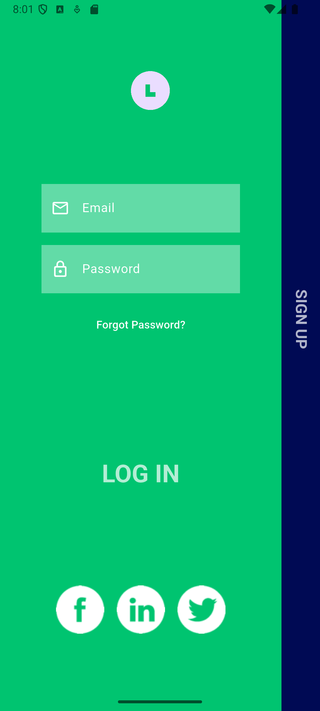
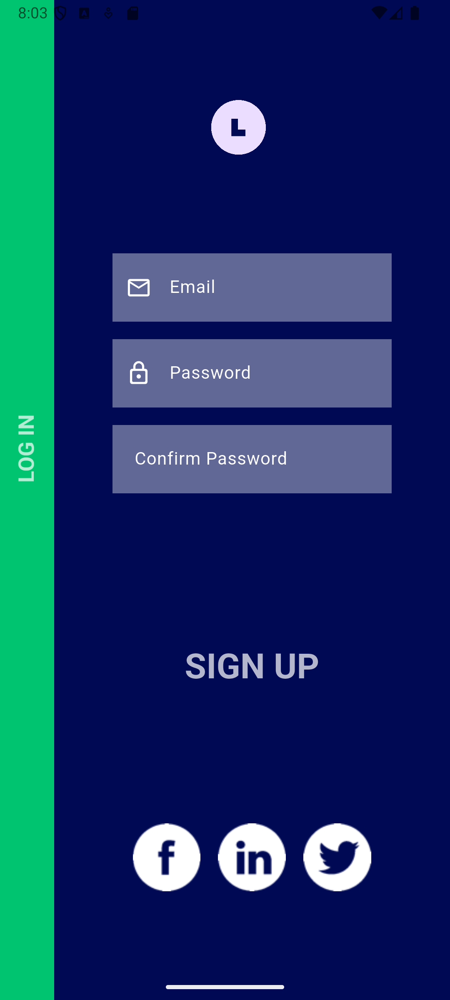

<h1 align="center">✨ Animated Login & Signup UI – Flutter ✨</h1>

  
  
  

  A beautifully animated, responsive, and modern <b>Login–Signup</b> authentication screen created using Flutter.
  Featuring smooth UI transitions, rotating text animations, and a clean component-based architecture.

---

## 📸 **Screenshots**

  
  &nbsp;&nbsp;&nbsp;
  

---

## ✨ **Features**

- 🚀 Smooth animated transitions between Login & Signup
- 🔄 Rotating text using `Transform.rotate`
- 🎨 Clean, aesthetic, minimal UI
- 📱 Fully responsive layout
- 🧩 Component-based widget structure
- 🟦 Uses SVG icons with `flutter_svg`
- ⚡ Built using `AnimationController`, `Tween`, `AnimatedPositioned`, etc.

---

## 🛠️ **Tech Stack**

| Technology | Purpose |
|-----------|---------|
| **Flutter** | UI Framework |
| **Dart** | Programming Language |
| **Animated Widgets** | Page transitions |
| **flutter_svg** | SVG assets |
| **Custom Widgets** | Login & Signup components |

---

## 📂 **Folder Structure**

